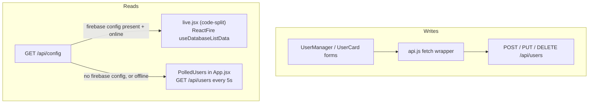

# System Map

The module map for `rentredi-sandbox`: one responsibility per file, a single
layered request path, and a frontend that picks its data source at runtime.

## Layered request flow

```mermaid
flowchart LR
    REQ[HTTP request] --> RT["routes/userRoutes.js"]
    RT --> VAL["middleware/validate.js<br>zod .strict() schema"]
    VAL -->|ZodError| EH
    VAL --> CTRL["controllers/userController.js<br>try / catch"]
    CTRL --> SVC["services/userService.js"]
    SVC --> DB["db/ facade<br>(memory | firebase)"]
    SVC --> LOC["services/locationService.js<br>OWM current-weather"]
    LOC -->|typed error thrown| CTRL
    DB --> CTRL
    CTRL -->|next(err)| EH["middleware/errorHandler.js<br>central handler"]
    CTRL -->|success| OK["res.json({ data })"]
    EH --> ERR["res.json({ error: { code, message, details? } })"]
```

Validation failures never reach the controller — `validate.js` forwards a
`ZodError` straight to `next()`. Everything else (typed `AppError`s from the
service/location layer, or an unexpected bug) is caught by the controller's
`try/catch` and forwarded the same way, so there is exactly one place that
decides the response shape.

## Frontend data-source split

Writes and reads take deliberately different paths — writes always go through
the API so the server keeps ownership of location enrichment, validation, and
the trust boundary; reads are live when Firebase is configured and poll
otherwise.



- **Writes → API, always.** Coordinates/timezone/id are never client-supplied.
- **Reads → ReactFire live subscription** when `/api/config` reports a
  Firebase web config *and* the browser is online — `live.jsx` subscribes to
  the `users` node over a WebSocket; writes still go through the API and RTDB
  pushes the change back, so `onChanged` is a no-op on that path.
- **Reads → API polling (fallback)** otherwise — `PolledUsers` polls
  `GET /api/users` every 5s. This is also what keeps the app runnable (and the
  e2e suite green) without a Firebase project, and what the service worker can
  cache for the offline banner.
- `LiveRoot` (ReactFire + `firebase`) is `lazy()`-imported and code-split, so
  the polling path never downloads the Firebase SDK.

## Module responsibilities — `src/`

| Module | Responsibility |
|---|---|
| `index.js` | Bootstrap only: loads config, calls `db.init()`, builds the app via `createApp()`, and is the only place that calls `.listen()`. Excluded from coverage. |
| `app.js` | Express app factory. Wires `compression`, `express.json`, `requestLogger`, static `web/dist`, `/health`, `/api/config`, the user router, then `notFoundHandler` + `errorHandler`. Never calls `.listen()` itself — that's what makes it testable with `supertest`. |
| `config.js` | Parses `process.env` through a zod schema once at startup; a bad/missing var throws and crashes the boot immediately. Produces the `config` object (`owm`, `db`, `webFirebase`, `gaId`) passed to every layer. |
| `logger.js` | Single `pino` structured JSON logger; level from `LOG_LEVEL`. |
| `errors.js` | Typed errors — `AppError` (base: status + code + `expected` flag), `ValidationError` (400), `NotFoundError` (404), `UpstreamError` (502/504) — so status codes are decided once, at the throw site. |
| `db/` | Repository facade (`index.js`) that delegates to whichever driver `config.db.driver` selected; `memory.js` is a `Map` keyed by `crypto.randomUUID()` (default, hermetic); `firebase.js` is the `firebase-admin` RTDB driver with the same CRUD interface, with an injectable `admin` param for testing. |
| `services/locationService.js` | ZIP (+country) → `{ lat, lon, timezone, timezoneName, city }` via OWM's current-weather endpoint (native `fetch` + `AbortController` timeout); `tz-lookup` derives the IANA zone name from the coordinates. Maps OWM failures to typed errors; `OWM_MOCK` short-circuits to a deterministic offline stub. |
| `services/userService.js` | CRUD orchestration; owns the rule that location is derived server-side and only refetched on `update` when ZIP or country actually changed. |
| `controllers/` | One method per route; each is `async` with an explicit `try/catch` forwarding to `next(err)`, and sets the HTTP status on success. |
| `routes/` | Wires `validate → controller` per verb/path. |
| `schemas/` | zod schemas, all `.strict()` — rejects (400) any client-supplied field outside the allow-list (notably `id`, `lat`, `lon`, `timezone`) instead of silently stripping it. |
| `middleware/` | `validate.js` (parses/replaces `req.params`/`req.body`, forwards `ZodError`), `requestLogger.js` (per-request child logger + request id, one completion log line), `errorHandler.js` (`notFoundHandler` + the central handler that builds the `{ error }` envelope). |

## Module responsibilities — `web/src/`

| Module | Responsibility |
|---|---|
| `App.jsx` | Data-source selector: renders the polling UI immediately (no loading gate), fetches `/api/config`, and upgrades to the live `LiveRoot` (code-split) when a Firebase web config is present and the browser is online; also inits GA and warms the offline cache. |
| `live.jsx` | ReactFire providers (`FirebaseAppProvider`, `DatabaseProvider`) + `useDatabaseListData` subscription on the `users` RTDB node. Only imported when Firebase is configured. |
| `components/` | `UserManager.jsx` (create form + list + globe, shared by both data sources), `UserCard.jsx` (view/edit one user, sends only changed fields), `LocalClock.jsx` (creative addition — ticking local time from the stored offset/zone), `Topbar.jsx`, `ThemeToggle.jsx`, `Globe.jsx` (lazy three.js globe, loaded on first interaction). |
| `api.js` / `util.js` | Thin `fetch` wrapper that unwraps `{ data }` / `{ error }` envelopes; formatting helpers (e.g. timezone label, local time string). |

## Related

- [[Request Lifecycle]] — one request traced through this exact map
- [[ADRs]] — the reasoning behind each layer
- [[ADR-0005-error-model]] — the typed-error / central-handler design
- [[ADR-0006-frontend-live-sync]] — the ReactFire-vs-polling split

← back to [[Architecture]]
